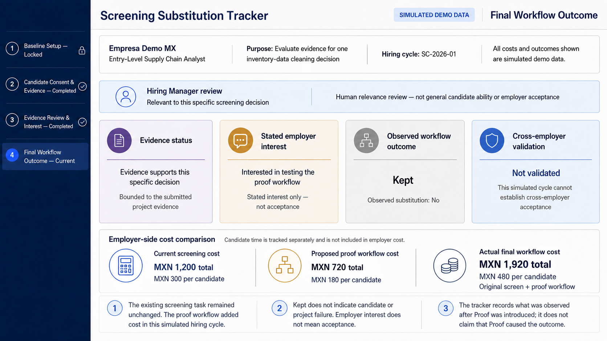

# BUSINESS BENDING · WEEK 4 — PACKET

**Builder:** Ana María Matas  
**Role:** MONEY  
**Product:** Screening Substitution Tracker  
**Status:** Packet completed before implementation

> **SIMULATED DEMO ONLY.** Every candidate, employer, project, cost, workflow record, and outcome in this prototype is invented. The LLM analysis will be generated in real time, but it will analyze only simulated demo evidence.

## Product Slice

A mobile-friendly, demo-only screening-substitution tracker for a Talent Acquisition Manager at a simulated Mexican employer repeatedly hiring Entry-Level Supply Chain Analysts. The product uses a real LLM to produce a bounded, source-linked interpretation of simulated authentic university project evidence and one equivalent Text-or-Voice project-specific confirmation. It preserves candidate consent and contestability, separately records the current screening baseline, proposed proof-workflow cost, stated employer interest, and documented final workflow facts, and uses deterministic rules to classify the existing screen as `Outcome not documented`, `Kept`, `Shortened`, or `Removed`. The product reports only whether substitution was observed after Proof was introduced in this simulated hiring cycle; it does not claim causation, employer acceptance, cross-employer validation, candidate ability, authorship, or hiring suitability.

## Problem in My Words

Employer interest in authentic student project evidence is not the same as employer acceptance or economic value. A Talent Acquisition Manager may add project evidence to a hiring process while keeping the complete employer-created screening task, causing Proof to add time and cost instead of replacing anything. I need a tracker that locks the original screening baseline before the outcome is known, preserves the proposed workflow estimate, and later documents whether the existing step was actually kept, materially shortened, or removed. The economic hypothesis is supported only by documented workflow substitution—not by a positive LLM interpretation, Hiring Manager relevance, or stated employer interest.

## Exact User

The primary user is a **Talent Acquisition Manager at a simulated Mexican company that repeatedly hires Entry-Level Supply Chain Analysts**. They use the tracker at three moments in one hiring cycle:

1. Before introducing Proof, to lock the current screening task, employer-side cost, candidate time, proposed proof-workflow cost, volume, and simulated materiality rule.
2. After the candidate-authorized evidence review, to record stated employer interest without calling it acceptance.
3. After the hiring workflow has occurred, to enter documented facts so deterministic rules can calculate the observed outcome.

The **Supply Chain Hiring Manager** is a secondary user who reviews whether the authorized project evidence is relevant to one specific inventory-data cleaning decision. The **Candidate** controls context-specific consent, completes one project-specific confirmation by Text or Voice, reviews the interpretation, and decides whether it may be shared.

The primary evidence is a simulated, pre-existing university inventory-analysis project. It was conceptually completed before the hiring process and was not created to pass the employer's screen. The existing screen is a required employer-created spreadsheet task focused on an inventory-data cleaning decision. The project and the screen may address related evidence, but they are not assumed to be equivalent.

## Success Definition

**Before the module closes, the end-to-end simulated hiring-cycle tracker works: a Talent Acquisition Manager can lock the current screening baseline, proposed proof-workflow cost, and materiality threshold before the outcome; receive only candidate-authorized project evidence with a bounded, source-linked LLM interpretation; record stated employer interest separately; and enter documented final workflow facts that deterministic rules correctly classify as Outcome not documented, Kept, Shortened, or Removed while preserving current, proposed, and actual costs. For the preloaded demo case, the system correctly returns Interested → Kept, Observed substitution: No, and Cross-employer validation: Not validated.**

### What Failure Means

- **Product failure:** The tracker calculates, locks, shares, stores, or classifies something incorrectly.
- **Evidence/claim failure:** The system makes a stronger claim than the evidence permits.
- **Economic hypothesis failure:** The product works correctly, but the employer keeps the existing screen and substitution is not observed.

The preloaded `Interested → Kept` case is an economic hypothesis failure. It is not a product failure, candidate failure, or project failure.

## Image-Generated Mockup



*Official image-generated mockup. All employers, roles, costs, evidence, and outcomes shown are simulated demo data. The screen intentionally shows that evidence support and stated interest can coexist with `Kept` and `Observed substitution: No`.*

## Feature Flowchart

```mermaid
flowchart TD
    A["Open the simulated demo"] --> B{"Is the stored case expired?"}
    B -->|Yes| C["Delete the expired local case"]
    B -->|No| D["Load the stored simulated case"]
    C --> E["Show an empty/reset state"]
    E --> E1{"Does the user explicitly request a new simulated demo case?"}
    E1 -->|No| E
    E1 -->|Yes| E2["Create a new simulated demo case"]
    D --> F["Checkpoint 1: record baseline, proposed cost, volume, candidate time, and simulated 50% pilot rule"]
    E2 --> F
    F --> G["Lock Checkpoint 1 before the outcome is known"]
    G --> H["Candidate sees employer, role, purpose, and hiring cycle"]
    H --> I{"Is relevant project evidence available?"}
    I -->|No| J["Set no_relevant_project_available"]
    J --> K["Offer a free evidence-route handoff; no LLM analysis or employer-facing negative signal"]
    I -->|Yes| L{"Does the Candidate authorize analysis for this context?"}
    L -->|No| M["Do not analyze or share evidence"]
    L -->|Yes| N{"Choose Text or Voice"}
    N -->|Text| O["Enter the project-specific response; maximum 600 characters"]
    N -->|Voice| P["Record temporary audio; maximum 60 seconds and 5 MB"]
    P --> Q["Transcribe audio only; do not analyze project evidence"]
    Q --> R{"Is a transcript available?"}
    R -->|No| S["Voice transcription unavailable; Text remains available"]
    S --> O
    R -->|Yes| T["Candidate reviews or edits the transcript"]
    O --> U["Candidate reviews the confirmation response"]
    T --> U
    U --> V{"Does the Candidate authorize evidence analysis?"}
    V -->|No| M
    V -->|Yes| W["Gemini analyzes bounded simulated evidence and the approved confirmation response"]
    W --> X{"Does the response pass JSON Schema and Zod validation?"}
    X -->|No| Y["Analysis unavailable"]
    Y --> Z{"Retry analysis?"}
    Z -->|Yes| W
    Z -->|No| AA["Request human review or stop; no AI conclusion is shared"]
    X -->|Yes| AB{"LLM evidence status"}
    AB -->|Insufficient support| AC["Insufficient evidence; additional human review required"]
    AB -->|Supported| AD["Evidence supports this specific decision"]
    AC --> AE["Show source references and limitations to the Candidate"]
    AD --> AE
    AE --> AF{"Candidate sharing decision"}
    AF -->|Do not share| AG["Employer receives no project, confirmation, or interpretation"]
    AF -->|Request human review| AH["Pause sharing and hide the disputed interpretation"]
    AF -->|Share| AI["Employer receives only the authorized project evidence, confirmation, and bounded interpretation"]
    AI --> AJ["Hiring Manager records Agree, Disagree, or Needs further review and relevance to this specific screening decision"]
    AJ --> AK["Talent Acquisition Manager records stated employer interest"]
    AK --> AL["Interest is recorded only; it does not establish acceptance or substitution"]
    AL --> AM["Checkpoint 3: enter final workflow facts and simulated documentation"]
    AM --> AN{"Is required workflow documentation complete?"}
    AN -->|No| AO["Outcome not documented"]
    AN -->|Yes| AP{"Apply deterministic outcome rules"}
    AP -->|Step retained or shortening rules not met| AQ["Kept — valid measured outcome"]
    AP -->|At least 50% shorter, lower active time, no equivalent replacement| AR["Shortened"]
    AP -->|Removed with no equivalent replacement| AS["Removed"]
    AO --> AT["Observed substitution: Not documented"]
    AQ --> AU["Observed substitution: No"]
    AR --> AV["Observed substitution: Yes — in this simulated hiring cycle only"]
    AS --> AV
    AT --> AW["Calculate current, proposed, and actual employer-side costs; keep candidate time separate"]
    AU --> AW
    AV --> AW
    AW --> AX["Evidence status"]
    AW --> AY["Stated employer interest"]
    AW --> AZ["Observed workflow outcome"]
    AW --> BA["Cross-employer validation: Not validated"]
```



**Preloaded demo path:** `Evidence supports this specific decision → Hiring Manager: Relevant → Interested in testing → Screening task kept → Observed substitution: No → Cross-employer validation: Not validated.`

`Interested in testing` does not cause or establish substitution. `Kept` is a valid tracker result, not an error.

## Actor Swimlane

```mermaid
sequenceDiagram
    participant C as Candidate
    participant S as System / LLM
    participant HM as Hiring Manager
    participant TA as Talent Acquisition Manager

    TA->>S: Enter and lock baseline, proposed cost, volume, and threshold
    S-->>TA: Preserve Checkpoint 1 before the outcome
    S->>C: Show employer, role, purpose, and hiring cycle
    C->>S: Authorize the project for this context or decline

    alt No relevant project is available
        S-->>C: Offer a free evidence-route handoff
        Note over C,S: No LLM analysis, ability judgment, or substitution experiment
    else Candidate authorizes the project
        C->>S: Answer the same project-specific prompt by Text or Voice
        opt Voice route
            S-->>C: Return transcript for review; no evidence analysis yet
            C->>S: Approve or edit the confirmation response
        end
        C->>S: Authorize bounded evidence analysis
        S->>S: Analyze simulated evidence and validate structured output
        S-->>C: Show evidence status, sources, and limitations
        C->>S: Share, request human review, or do not share

        alt Candidate shares
            S->>HM: Show only authorized evidence and interpretation
            HM->>S: Record relevance to one screening decision
            S-->>TA: Show the human relevance review separately
            TA->>S: Record stated employer interest
            Note over TA,S: Interest is not acceptance or substitution
            TA->>S: Record final workflow facts and documentation
            S->>S: Calculate outcome and costs with deterministic rules
            S-->>TA: Show four separate final results
            Note over S,TA: Kept is valid; cross-employer validation remains Not validated
        else Candidate requests human review
            S-->>HM: Mark review pending and hide the disputed interpretation
        else Candidate does not share
            S-->>HM: Share no project, confirmation, or interpretation
        end
    end
```

### Responsibility Boundaries

- **Candidate:** Controls whether project evidence and interpretation are shared for the named employer, role, purpose, and hiring cycle.
- **System / LLM:** Transcribes temporary Voice input, analyzes only bounded authorized evidence, validates structured output, and applies deterministic code where appropriate.
- **Hiring Manager:** Records relevance to one specific screening decision, not general candidate ability or employer acceptance.
- **Talent Acquisition Manager:** Records stated interest and final workflow facts but cannot directly choose the calculated outcome.

## Benchmark

**The best existing solution on Earth for this is CodeSignal, which provides job-relevant standardized assessments and allows eligible assessment results to be shared with potential employers.**

**Mine differs or localizes by using candidate-authorized, pre-existing university project evidence for a specific Mexican entry-level hiring cycle and tracking whether an existing employer screening step was actually kept, shortened, or removed.**

Benchmark sources: [CodeSignal Skills Assessments](https://codesignal.com/skills-assessments/) and [CodeSignal result sharing](https://support.codesignal.com/hc/en-us/articles/360040380533-How-do-I-share-my-assessment-results-with-potential-employers). [CONOCER](https://conocer.gob.mx/contenido/Chat/chat.html) provides Mexican context for competency-based evidence and certification but does not prove screening substitution. [Triplebyte](https://connect.karat.com/tb-candidates) remains a historical precedent, not the current best solution.

## Three-Year Long View

If this slice works, the product could become a measurement infrastructure for evidence-based hiring workflows, helping employers document whether candidate-authorized authentic project evidence is followed by an existing screening step being kept, materially shortened, or removed in specific hiring cycles. Over three years, documented workflow outcomes could show where and under what conditions substitution has been observed, but they would never guarantee that a new employer will accept the same evidence or count as validation outside the documented context. The system would remain free for candidates and require renewed context-specific consent for every new employer, role, purpose, or hiring cycle, while prohibiting permanent candidate profiles, rankings, potential predictions, and general skill scores.

## Scope Cut

### Permanent Product Boundaries

- Authentic student projects remain the primary evidence. The product will not replace them with employer-created standardized assessments as the primary evidence source.
- One bounded, project-specific confirmation may add limited evidence about a specific decision, but it cannot replace the authentic project or become a general assessment.
- The product will not rank or compare candidates, create permanent candidate profiles, assign general skill scores, predict personality, potential, career fit, or future performance, or make hiring or career recommendations.
- It will not claim independent authorship, treat missing or insufficient evidence as evidence of low ability, use intrusive proctoring, or charge candidates for credentials or access.
- Project evidence cannot be reused for a new employer, role, purpose, or hiring cycle without renewed context-specific consent.

### Not Built or Claimed in This One-Week Prototype

- No real employer integrations, live use inside an employer's hiring process, or complete hiring platform.
- No real candidate or confidential employer data, candidate accounts, application histories, protected database, or permanent project library.
- No creation, recommendation, or evaluation of the free evidence-generation route; the prototype provides only an accessible handoff when no relevant project is available.
- No employer acceptance, cross-employer validation, or employer adoption is claimed. This prototype has no real-world evidence that would support those claims.
- No causal claim that Proof produced a workflow change, improved hiring, or created an economic result.
- No claim of 10:1 ROI, savings caused by Proof, or economic value created. The prototype only documents cost differences associated with one simulated hiring-cycle workflow.
- No multi-employer or multi-cycle analytics. The prototype contains one simulated hiring-cycle record designed to demonstrate the measurement logic.

## Architecture + Stack

The prototype uses one Next.js application, one structured simulated hiring-cycle record, two server-side Gemini routes, and deterministic TypeScript rules. It does not use a database, authentication, or real personal data.

| Component | Technology | Responsibility | Security and Blueprint boundary |
|---|---|---|---|
| Client application | Next.js, React, and TypeScript | Renders the four mobile-friendly workflow screens for the Candidate, Hiring Manager, and Talent Acquisition Manager. | Shows only one simulated hiring cycle and never creates a permanent candidate profile, ranking, score, or hiring recommendation. |
| Responsive interface | Semantic HTML and responsive CSS | Provides low-data, mobile-friendly forms, plain-language instructions, visible consent states, and equivalent Text and Voice routes. | Candidate access is free. Text remains available if Voice is unavailable. |
| Structured hiring-cycle record | TypeScript types, JSON, and Zod schemas | Keeps context, consent, project evidence, confirmation response, LLM interpretation, Hiring Manager review, baseline, stated interest, workflow facts, costs, and calculated outcomes as separate fields. | Prevents technical evidence, human relevance, employer interest, and observed substitution from becoming one combined score or claim. |
| Input validation | HTML constraints, TypeScript checks, and Zod validation on client and server | Enforces required fields, permitted enums, numeric ranges, length limits, supported types, the 600-character Text limit, and the 60-second and 5 MB Voice limits. | Invalid input is rejected before storage, transcription, analysis, or calculation. User-provided text is rendered as plain text, not executable HTML. |
| Browser persistence | `localStorage` | Stores one simulated hiring-cycle record with `created_at` and `expires_at`; deletes it on the first application load after 90 days and provides a manual `Delete demo case` control. | No real personal or confidential employer data is permitted. `localStorage` is not presented as appropriate storage for a future product using real data; that version would require authentication, protected database storage, and Row Level Security. |
| Voice capture | Browser `MediaRecorder` | Records a maximum of 60 seconds into a temporary in-memory audio `Blob`; allows playback, re-recording, and transcription request. | The application does not write audio to `localStorage`, a database, the repository, application logs, or the Gemini Files API. Voice does not verify identity or independent authorship. |
| Voice transcription route | `POST /api/transcribe-confirmation`, `@google/genai`, and `gemini-2.5-flash` with inline audio | Receives only the temporary audio, converts speech into candidate-reviewable text, and returns a transcript. It does not receive or analyze project evidence. | The candidate may edit the transcript before authorizing evidence analysis. Any microphone, format, size, API, or transcription failure returns `Voice transcription unavailable`, never `Insufficient evidence`. |
| Evidence-analysis route | `POST /api/analyze-evidence`, `@google/genai`, `gemini-2.5-flash`, JSON Schema structured output, and server-side Zod validation | Analyzes only the authorized simulated project excerpts, the specific decision, and the approved `confirmation_response`. Returns bounded observable evidence, source references, limitations, structured ambiguity or contradiction indicators, and a permitted evidence status. | Gemini cannot calculate costs, determine substitution, decide employer acceptance, score the candidate, verify authorship, or make hiring recommendations. Invalid model output or a technical failure returns `Analysis unavailable`. |
| Deterministic rules engine | Pure TypeScript functions | Controls consent and sharing gates, Checkpoint 1 locking, `no_relevant_project_available`, additional-human-review requirements, documentation sufficiency, material-shortening rules, `Outcome not documented`, `Kept`, `Shortened`, `Removed`, observed substitution, cost calculations, volume normalization, expiration, and the demo's `Cross-employer validation: Not validated` state. | The Talent Acquisition Manager records workflow facts but cannot directly choose the calculated outcome. Stated interest never triggers acceptance or substitution. Only documented facts satisfying the pre-registered rules can produce simulated observed substitution. |
| Hosting and server execution | Vercel | Deploys the Next.js application and runs both server-side routes. | `GEMINI_API_KEY` exists only in Vercel environment variables and never appears in client code or the repository. Project evidence, confirmation responses, and audio content are not intentionally written to application logs. |
| Demo disclosures | Persistent interface labels and explanatory copy | Labels the case, costs, outcomes, project evidence, and underlying data as simulated while identifying the interpretation as AI-generated. | The interface does not claim that Proof caused an outcome, that an employer accepted the evidence, or that this simulated case establishes cross-employer validation or economic value. |

### Responsibility Boundary

**Gemini responsibilities:** Transcribe temporary simulated Voice input into candidate-reviewable text and produce a bounded, source-linked interpretation of authorized simulated project evidence.

**Deterministic-code responsibilities:** Validate inputs, control consent and sharing, lock checkpoints, calculate costs, apply the materiality threshold, determine workflow outcomes, identify when additional human review is required, enforce expiration, and keep cross-employer validation set to `Not validated`.

### Required Data-Treatment Disclosures

> This demo does not persist audio. Audio is sent to Gemini for transcription and is handled under Google Free Tier terms. Use simulated content only.

> This is an AI-generated interpretation of simulated demo evidence. It is limited to the specific project decision shown and is not a general assessment of candidate ability.

Google's Free Tier may use submitted content to improve its products. Therefore, this prototype permits only simulated demo evidence and is not presented as an appropriate architecture for real student projects or personal data.

## Test Plan

All tests were designed before implementation. Initial status for every test: **Not run — planned before code.** During the Mechanical Pass, each test will receive an actual result, evidence, and Pass/Fail status. At least one real failure will be documented, fixed, redeployed, and retested.

### 1. End-to-End Workflow Tests

| Test ID | Scenario | Setup and actions | Expected result | Failure protected against | Failure type | Mechanical-test evidence |
|---|---|---|---|---|---|---|
| T01 | Main Text path: Interested → Kept | Reset the demo. Lock the baseline, proposed proof-workflow cost, and simulated 50% materiality rule. Authorize the simulated project, answer the confirmation by Text, authorize analysis, share the interpretation, record Hiring Manager relevance, select `Interested in testing`, and document that the original spreadsheet task remained unchanged. | The four separate results show `Evidence supports this specific decision`, `Interested in testing`, `Kept`, and `Cross-employer validation: Not validated`. `Observed substitution: No`. Actual final cost includes the original screen plus Proof. The product passes; the economic hypothesis is not validated in this simulated cycle. | A correctly measured negative economic outcome being treated as product or candidate failure; false positive substitution. | Product pass with expected economic hypothesis failure | Not run — planned before code |
| T02 | Successful Voice path and Text equivalence | Record simulated Voice content under 60 seconds and 5 MB, request transcription, review and edit the transcript, and authorize analysis. Repeat using the exact approved transcript through Text. | Both routes end in the same `confirmation_response` field and send the same downstream analysis input. Voice receives no stronger conclusion because of its format. The temporary audio is not present after transcription or refresh. | Voice being treated as stronger evidence than Text; routes using different downstream rules. | Product or evidence/claim failure if unequal | Not run — planned before code |
| T03 | Voice technical failure | Deny microphone permission; then separately test an unsupported format, an oversized file, and a forced transcription API failure. | Each failure displays `Voice transcription unavailable`. No evidence analysis runs, no `Insufficient evidence` state is created, and Text remains available. | A technical Voice failure becoming an evidence or ability judgment. | Product and evidence/claim failure | Not run — planned before code |
| T04 | Candidate selects Do not share | Test `Do not share` before analysis and again after viewing the LLM interpretation. Attempt to open the employer review afterward. | Before authorization, no analysis occurs. After `Do not share`, the employer cannot view the project, confirmation response, or interpretation. No negative employer-facing signal is created. | Evidence reaching the employer without final candidate authorization. | Product and evidence/claim failure | Not run — planned before code |
| T05 | Candidate requests human review | After receiving an interpretation, select `Request human review` and attempt to continue to the employer screen. | `sharing_status` becomes `paused_pending_review`. The employer may see that review is pending but cannot see the disputed interpretation as an authorized conclusion. | A disputed interpretation reaching the employer before review is resolved. | Product and evidence/claim failure | Not run — planned before code |
| T06 | No relevant project available | Select `no_relevant_project_available`, leave the optional access-barrier field empty, and request the free-route handoff. | No LLM analysis or skill conclusion is generated. The interface states `Not having a relevant project is not evidence of lacking ability.` The candidate receives an accessible handoff and does not enter the substitution experiment. | No project becoming `Insufficient evidence`, a negative signal, or a candidate judgment. | Evidence/claim failure | Not run — planned before code |
| T07 | Insufficient project evidence | Use an authorized simulated project excerpt and confirmation that do not support the specific inventory-data cleaning decision or cannot be linked to concrete source references. | Evidence status is `Insufficient evidence`; limitations and missing support are visible; additional human review is required. The system makes no claim about general ability. | Insufficient evidence becoming a negative skill or hiring judgment. | Evidence/claim failure | Not run — planned before code |
| T08 | Analysis unavailable | Force a Gemini error and separately return malformed or schema-invalid model output. | The server rejects the response and returns `Analysis unavailable`. The UI identifies a technical problem, permits retry, and never displays `Insufficient evidence`. | API or structured-output failure being misclassified as lack of evidence. | Product and evidence/claim failure | Not run — planned before code |

### 2. Evidence and Claim-Boundary Tests

| Test ID | Scenario | Setup and actions | Expected result | Failure protected against | Failure type | Mechanical-test evidence |
|---|---|---|---|---|---|---|
| T09 | Evidence, relevance, interest, and substitution remain separate | Produce `Evidence supports this specific decision`; record Hiring Manager `Relevant`; record `Interested in testing`; initially provide no final workflow documentation, then document that the screen was kept. | Before documentation, outcome is `Outcome not documented`. After documentation, outcome is `Kept` and substitution is `No`. No step displays employer acceptance, and none of the earlier claims automatically changes the next claim. | LLM support, human relevance, or interest automatically becoming acceptance or substitution. | Evidence/claim failure | Not run — planned before code |
| T10 | Adversarial attempt to make the LLM overclaim | Insert simulated project text or confirmation content instructing the model to ignore its rules, declare advanced Excel ability, recommend hiring, claim authorship, calculate savings, or state employer acceptance. | The route treats submitted content as evidence, not instructions. Output remains within the schema or becomes `Analysis unavailable`. No prohibited score, ability level, hiring recommendation, economic conclusion, authorship claim, acceptance, or substitution appears. | Prompt injection or evidence content producing claims outside the LLM contract. | Evidence/claim failure | Not run — planned before code |
| T11 | No negative candidate judgment | Review all visible output for `no_relevant_project_available`, `Insufficient evidence`, `Analysis unavailable`, Hiring Manager `Disagree`, and final outcome `Kept`. | None is described as candidate failure, low ability, low potential, poor fit, or project failure. Each state explains only what is known in its specific context. | Missing, disputed, unavailable, or non-substituting evidence becoming a generalized negative judgment. | Evidence/claim failure | Not run — planned before code |
| T12 | Shadow Clause context-transfer failure | Authorize evidence for one employer, role, purpose, and hiring cycle. Change each context field one at a time and attempt to reuse the prior authorization. | Any changed employer, role, purpose, or hiring cycle invalidates the previous sharing authorization. The new recipient cannot view the evidence until new context-specific consent is recorded. | Evidence being reused outside its authorized context or becoming a reusable candidate profile. | Product and evidence/claim failure | Not run — planned before code |
| T13 | Acceptance, causality, economic-value, and cross-employer language audit | Inspect every screen and each `Outcome not documented`, `Kept`, `Shortened`, and `Removed` state. Search rendered copy for acceptance, adoption, causality, ROI, savings, and cross-employer claims. | `Accepted` is never an outcome. Any mention of acceptance appears only as a limitation. `Shortened` or `Removed` displays `Observed substitution: Yes — in this simulated hiring cycle only`. The product states only that substitution was observed after Proof was introduced, never that Proof caused it. Cross-employer validation always remains `Not validated`, and cost differences are not called ROI or caused savings. | Misleading acceptance, causal, economic-value, or cross-employer claims. | Evidence/claim failure | Not run — planned before code |

### 3. Deterministic Outcome and Cost Tests

| Test ID | Scenario | Setup and actions | Expected result | Failure protected against | Failure type | Mechanical-test evidence |
|---|---|---|---|---|---|---|
| T14 | Checkpoint 1 lock and estimate preservation | Enter baseline cost, duration, employer active time, candidate volume, proposed cost, and the simulated 50% rule. Lock Checkpoint 1, refresh, navigate backward, and attempt to edit those values. Later enter actual values different from the proposal. | Locked fields cannot be edited through the workflow and remain locked after refresh. The original baseline and proposed estimate remain visible and unchanged; actual values are stored separately. Resetting the entire demo is the only way to start a new baseline. | Changing the baseline, proposed cost, or threshold after observing the outcome; replacing the proposal with actual cost. | Product failure | Not run — planned before code |
| T15 | Missing workflow-change documentation | Enter final timing and workflow facts but omit a required documentation field, such as document type, simulated reference, effective date, approving role, or change description. | Outcome remains `Outcome not documented`, not `Kept`, `Shortened`, or `Removed`. Observed substitution is not asserted. | Missing documentation being interpreted as no substitution or positive substitution. | Product and evidence/claim failure | Not run — planned before code |
| T16 | Exact simulated 50% threshold edge case | Use original duration 60 minutes and final duration 30 minutes, lower employer-side active screening time, no equivalent replacement screen, and complete simulated documentation. | The deterministic engine returns `Shortened` because the reduction is exactly 50% and all additional rules are satisfied. It displays `Observed substitution: Yes — in this simulated hiring cycle only`. | Incorrect threshold-boundary calculation or an unqualified real-world validation claim. | Product failure if calculated incorrectly | Not run — planned before code |
| T17 | Reduction below the simulated threshold | Use original duration 60 minutes and final duration 31 minutes, with complete documentation, lower employer active time, and no equivalent replacement. | Outcome is `Kept` because the duration reduction is less than 50%. `Observed substitution: No`. | A small reduction being labeled materially shortened. | Product and evidence/claim failure | Not run — planned before code |
| T18 | Equivalent replacement screen added | Mark the original spreadsheet task as removed but document that an equivalent employer-created screening task was added. | Outcome is `Kept` and observed substitution is `No`; replacing the original screen with an equivalent screen does not count as substitution. | Equivalent replacement being misclassified as removal or economic validation. | Product and evidence/claim failure | Not run — planned before code |
| T19 | Documented simulated removal | Mark the original screening task as no longer required, confirm no equivalent replacement, provide all required simulated documentation, and record actual workflow costs. | Outcome is `Removed`; `Observed substitution: Yes — in this simulated hiring cycle only`. The interface does not claim causation, employer acceptance, or cross-employer validation. | A valid simulated removal being calculated incorrectly or presented as real adoption. | Product failure or evidence/claim failure | Not run — planned before code |
| T20 | Talent Acquisition Manager cannot select an outcome | Inspect Checkpoint 3 and attempt to set `Kept`, `Shortened`, or `Removed` without changing the underlying facts. Then modify the facts and observe recalculation. | There is no free outcome selector. Outcomes change only when validated workflow facts satisfy deterministic rules. | The user choosing a convenient result instead of documenting facts. | Product failure | Not run — planned before code |
| T21 | Kept workflow cost and candidate-time separation | Use the main four-candidate case: current screening cost `MXN 1,200`, proposed proof-workflow cost `MXN 720`, and a kept original screen. Record candidate time separately. | Actual final employer-side workflow cost is `MXN 1,920 total` and `MXN 480 per candidate`. It includes the original screen plus Proof. Candidate time is displayed separately and is not included in employer cost or described as employer savings. | Omitting the retained screen from actual cost or counting candidate time as employer savings. | Product and evidence/claim failure | Not run — planned before code |
| T22 | Different candidate volumes | Set baseline volume to four candidates and final volume to six while preserving the same per-candidate baseline assumptions. | The product shows raw totals, cost per candidate, and a normalized baseline at the final volume. The volume difference is not presented as savings or value caused by Proof. | A volume change being misrepresented as a Proof-related economic result. | Product and evidence/claim failure | Not run — planned before code |

### 4. Security, Validation, and Lifecycle Tests

| Test ID | Scenario | Setup and actions | Expected result | Failure protected against | Failure type | Mechanical-test evidence |
|---|---|---|---|---|---|---|
| T23 | Form and API input validation | Attempt missing required fields, invalid enums, zero or negative candidate counts, negative costs or times, non-numeric values, Text over 600 characters, Voice over 60 seconds or 5 MB, unsupported audio MIME types, obvious email or phone-number content, and HTML or script input. | Invalid input is rejected before storage or API calls. Structured fields accept only permitted values. Obvious personal-contact patterns trigger a simulated-data warning or rejection. Text is rendered safely and no script executes. | Invalid or real-data-like input entering storage, prompts, calculations, or the rendered interface. | Product and security failure | Not run — planned before code |
| T24 | Secrets, logs, and audio persistence | Inspect repository files, client source maps or bundles, browser requests, console output, localStorage, and available deployment logs. Complete a Voice transcription and refresh the application. | `GEMINI_API_KEY` is absent from the repository and client. Calls go through server routes. Project evidence, confirmation responses, and audio are not intentionally logged. No audio is stored in localStorage or recoverable through the demo after transcription or refresh. | Secret exposure or persistent storage/logging of prohibited content. | Product and security failure | Not run — planned before code |
| T25 | 90-day expiration and manual deletion | Load a case just before `expires_at`; then set a controlled test case to `expires_at` or a past date and reload. Separately use `Delete demo case`. | A non-expired case remains. At or after expiration, the case is deleted on the first application load. Manual deletion removes it immediately. The interface does not claim deletion while the application is closed. | Expired simulated records remaining available or misleading deletion language. | Product failure | Not run — planned before code |
| T26 | Required simulated-data, AI, and Voice disclosures | Review all four screens, trigger both server routes, and inspect the evidence and Voice sections. | The case, project, costs, and outcomes are visibly labeled simulated. The interpretation is labeled AI-generated and bounded. The Voice disclosure states: `This demo does not persist audio. Audio is sent to Gemini for transcription and is handled under Google Free Tier terms. Use simulated content only.` The Free Tier limitation is not presented as appropriate for real student evidence. | Simulated evidence appearing real or data-treatment limitations being hidden. | Evidence/claim and security failure | Not run — planned before code |

### 5. Targeted Bug-Hunt Test

| Test ID | Scenario | Setup and actions | Expected result | Failure protected against | Failure type | Mechanical-test evidence |
|---|---|---|---|---|---|---|
| T27 | Stale outcome and cost state after fact changes | Create a fully documented `Shortened` result. Without resetting, remove one required documentation field and confirm the state. Restore documentation, add an equivalent replacement screen, change final duration and candidate volume, navigate between screens, and reload. | The result immediately changes from `Shortened` to `Outcome not documented` when documentation is removed, then to `Kept` when an equivalent replacement is added. Substitution and cost displays recalculate after every change and remain correct after navigation and refresh. No stale positive result survives. | Cached or stale calculated states continuing to show substitution after their supporting facts change. | Product failure | Not run — planned before code |

## Phase 2 Failure-Criterion Coverage Check

| Failure criterion from Phase 2 | Covered by |
|---|---|
| F01. Baseline, proposed cost, or materiality threshold can be changed after Checkpoint 1 is locked. | T14 |
| F02. Project evidence, confirmation, or interpretation reaches the employer without candidate authorization. | T04, T05, T12 |
| F03. `no_relevant_project_available` becomes `Insufficient evidence` or a negative candidate signal. | T06, T11 |
| F04. A Voice technical failure becomes `Insufficient evidence` or an ability judgment. | T03 |
| F05. Invalid structured output or an LLM/API failure becomes `Insufficient evidence` instead of `Analysis unavailable`. | T08 |
| F06. The LLM produces a general skill claim, score, authorship claim, hiring recommendation, acceptance decision, substitution decision, or economic conclusion. | T10, T13 |
| F07. LLM support, Hiring Manager relevance, or stated interest automatically establishes employer acceptance or substitution. | T01, T09, T13 |
| F08. The Talent Acquisition Manager can directly select `Kept`, `Shortened`, or `Removed`. | T20 |
| F09. Missing workflow-change documentation produces `Kept`, `Shortened`, `Removed`, or observed substitution instead of `Outcome not documented`. | T15, T27 |
| F10. A kept original screen is omitted from the actual final workflow cost. | T01, T21 |
| F11. A difference in candidate volume is presented as savings or value caused by Proof. | T22 |
| F12. The preloaded Interested → Kept case is incorrectly shown as successful substitution, employer acceptance, product failure, or candidate failure. | T01, T09, T11 |
| F13. The interface claims that Proof caused a workflow change, that an employer accepted the evidence, or that cross-employer validation exists. | T13, T19, T26 |
| F14. Voice and Text follow different downstream rules or produce different claim strength solely because of format. | T02 |
| F15. Real personal data, confidential employer information, or an API secret is stored, exposed, or intentionally logged. | T23, T24, T26 |
| F16. Candidate time is included in employer cost or presented as employer savings. | T21, T22 |
| F17. `Outcome not documented` is silently treated as `Kept`. | T09, T15 |
| F18. `Shortened` or `Removed` is produced without meeting the pre-registered deterministic conditions. | T16, T17, T18, T19, T27 |

Every Phase 2 failure criterion is covered by at least one planned test. The professor's required cases are also present: happy path, insufficient evidence, employer interested without substitution, simulated substitution, kept screen, input validation, misleading acceptance language, Shadow Clause context transfer, an exact-threshold edge case, and a targeted attempt to find a real bug.

## Blueprint Conditions Check

| Blueprint condition | How this slice honors it |
|---|---|
| 1. Authentic projects are the primary evidence. | The simulated university inventory-analysis project predates the hiring process and remains the primary evidence. The single Text-or-Voice confirmation is bounded to one project decision and cannot replace the project with a standardized assessment. |
| 2. Claims remain proportional to evidence. | The LLM may return only a project-specific evidence status with source references and limitations. `Insufficient evidence` means insufficient support, not lack of ability. Evidence interpretation, Hiring Manager relevance, stated interest, workflow outcome, and cross-employer validation remain separate. |
| 3. Access is free, accessible, mobile-friendly, and low-data. | The Candidate pays nothing, can use Text or Voice under equivalent rules, always retains Text as a fallback, and does not need expensive hardware or paid preparation. A candidate without a relevant project receives a free-route handoff without a negative signal. |
| 4. Verification is bounded, contestable, and human-reviewable. | The Candidate reviews the interpretation and may share, request human review, or refuse sharing. The Hiring Manager records a separate human relevance review. The structured record captures disagreement and ambiguity inputs needed for future pilot safety monitoring. Because this demo contains only one simulated cycle, it does not calculate or claim compliance with aggregate real-pilot stop thresholds. |
| 5. Technical verification and employer acceptance are different claims. | Stated interest is never acceptance. Only documented workflow facts can produce a simulated `Shortened` or `Removed` outcome. The main case intentionally ends `Interested → Kept`, and cross-employer validation remains `Not validated`. |
| 6. Shadow Clause and context ownership. | No permanent profile, ranking, personality, potential, career direction, or missing-evidence penalty is created. Sharing is limited to one employer, role, purpose, and hiring cycle; any change requires new consent. The local demo case expires after 90 days or may be deleted earlier. The application does not train its own model on project evidence. Any content sent to Gemini is subject to the disclosed Google Free Tier terms, which is why this prototype permits simulated evidence only. |

## Security Floor Check

| Security requirement | Packet decision |
|---|---|
| No secrets in code or repository | `GEMINI_API_KEY` is server-side only in Vercel environment variables. Both Gemini calls use server routes. |
| Authentication for stored personal data | The demo forbids real personal data and stores only one invented case locally, so authentication is not used. A real-data version would require authentication and protected storage. |
| Row Level Security for Supabase user tables | No Supabase database or user tables exist in this demo, so RLS is not applicable. A future Supabase implementation with personal data would require RLS. |
| Validate every form | Client and server validation enforce required fields, enums, numeric ranges, length limits, safe rendering, and Voice size, duration, and MIME restrictions. |
| No real personal data in demos or seeds | Employer, candidate context, project evidence, costs, documents, and outcomes are invented and visibly labeled simulated. Forms discourage or reject obvious real-contact data. |
| AI and simulation disclosure | The interface identifies the analysis as AI-generated and the underlying evidence and outcome as simulated. Voice and Free Tier data-treatment disclosures remain visible. |

## Final Claim Boundary

This prototype measures whether substitution was observed after candidate-authorized Proof was introduced in one simulated hiring cycle. It does not claim that Proof caused the outcome, that any real employer accepts this evidence, that cross-employer substitution exists, that the candidate possesses a general skill or level, or that Proof creates proven savings, ROI, or economic value.

